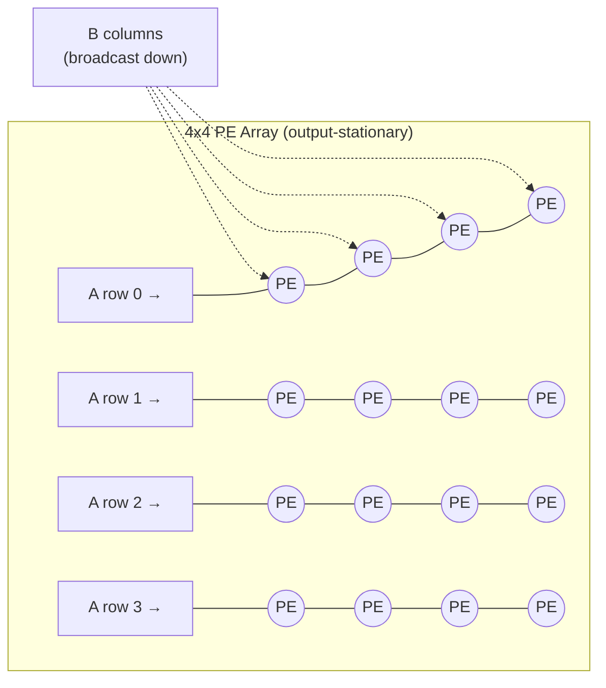
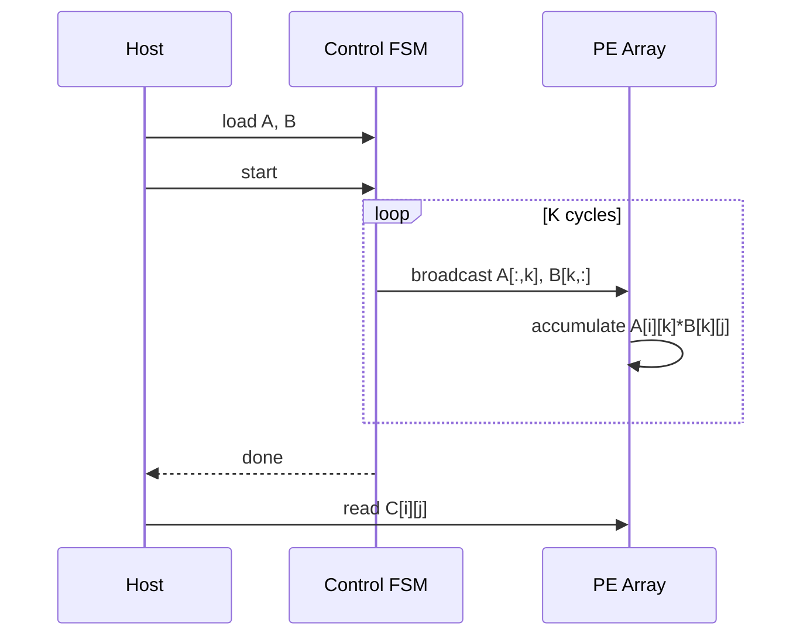

# INT8 Matrix-Multiplication Accelerator


A small INT8 MAC-array accelerator in SystemVerilog that computes:

```
C[N x M] = A[N x K] x B[K x M]
```

This is the core operation behind convolution and fully-connected layers
in neural-network inference.

> **Status:** RTL design, fully simulated and self-checked (353/353 checks
> passing). Not yet synthesized on an FPGA.

---

## How it works

Each output element `C[i][j]` gets its own tiny processing element (PE)
that multiplies and accumulates locally. Every PE runs in parallel:



On each of the `K` reduction cycles: row `i` gets fed `A[i][k]`, column `j`
gets fed `B[k][j]`, and every PE computes `A[i][k] * B[k][j]` and adds it to
its own running total. After `K` cycles, every PE holds its final answer —
this is the **output-stationary** dataflow.



## Modules

| File | Role |
|---|---|
| `rtl/mac_unit.sv` | One INT8 multiply-accumulate cell — the building block of every PE |
| `rtl/control_fsm.sv` | Sequences the K-cycle compute (`IDLE → RUN → DONE`) |
| `rtl/requantize_unit.sv` | Rounds/saturates the wide accumulator back to INT8 (real NPU output stage) |
| `rtl/int8_matmul_accelerator.sv` | Top level — memories, PE array, load/read ports |

**Defaults:** `N=K=M=4`, INT8 in, 32-bit accumulate. Fully parameterizable
for a bigger array.

### Interface

| Port group | Signals | Purpose |
|---|---|---|
| Load | `wr_en`, `wr_target` (0=A,1=B), `wr_addr`, `wr_data` | Write A/B into the accelerator |
| Control | `start`, `done` | Kick off compute, know when it's finished |
| Read | `rd_en`, `rd_addr` → `rd_data_raw`, `rd_data_q`, `rd_shift` | Read back raw or requantized INT8 result |

## Why it's built this way

- **32-bit accumulator:** worst case `127 × 127 ≈ 16K` per term — 32 bits
  is way more headroom than needed, so overflow just isn't a concern here.
- **Output-stationary, not weight-stationary:** simplest control logic to
  actually finish and verify correctly. Weight-stationary (load weights
  once, stream many activations through) is the natural next step and the
  more power-efficient real-world choice — see [Roadmap](#roadmap).
- **Requantization stage:** real INT8 pipelines don't pass 32-bit values
  between layers — they round + saturate back to INT8 using a scale factor.
  `requantize_unit.sv` does exactly that (round-half-up, saturate at ±127/-128).

## Verification

Self-checking testbench (`tb/tb_int8_matmul_accelerator.sv`) — computes an
independent golden model in SystemVerilog (cross-checked against
`scripts/golden_model.py` in numpy) and compares every output.

| Test | What it checks |
|---|---|
| Directed | Small, hand-verifiable values |
| Edge-value | `+127 / -128 / 0` mixed everywhere — sign handling, overflow margin |
| Randomized ×20 | Uniform random INT8 operands |
| Saturation | Requantizer clips correctly at the INT8 boundary |

**Result: 353/353 checks passing.**

<details>
<summary><b>A real bug I hit while building this (worth reading)</b></summary>

<br>

The first version of this testbench drove its write-port signals right
after `@(posedge clk)` — which races against the DUT's own `always_ff`
sampling on that exact same edge (their execution order at the same
instant isn't guaranteed). About half of every write silently vanished.

Fixed it by driving stimulus on `@(negedge clk)` and letting the DUT sample
on the rising edge — the standard discipline that guarantees a full
half-period of margin. Worth being able to explain if it comes up.

</details>

## Running it

```bash
make sim      # compile + run, prints PASS/FAIL summary
make wave     # same, + dumps wave.vcd for GTKWave
make clean
```

<details>
<summary>ModelSim / QuestaSim</summary>

```tcl
vlib work
vlog -sv rtl/mac_unit.sv rtl/requantize_unit.sv rtl/control_fsm.sv rtl/int8_matmul_accelerator.sv tb/tb_int8_matmul_accelerator.sv
vsim -c tb_int8_matmul_accelerator -do "run -all; quit"
```
</details>

<details>
<summary>Python cross-check</summary>

```bash
pip install numpy
python3 scripts/golden_model.py
```
</details>

## Roadmap

- [ ] Synthesize + deploy on FPGA (Basys3 / DE10-Lite), report LUTs/FFs/DSPs and max clock
- [ ] Weight-stationary variant, benchmarked against this one
- [ ] Scale up array size and reduction dimension

## Structure

```
int8_matmul_accelerator/
├── rtl/
│   ├── mac_unit.sv
│   ├── control_fsm.sv
│   ├── requantize_unit.sv
│   └── int8_matmul_accelerator.sv
├── tb/
│   └── tb_int8_matmul_accelerator.sv
├── scripts/
│   └── golden_model.py
├── Makefile
├── .gitignore
└── README.md
```
